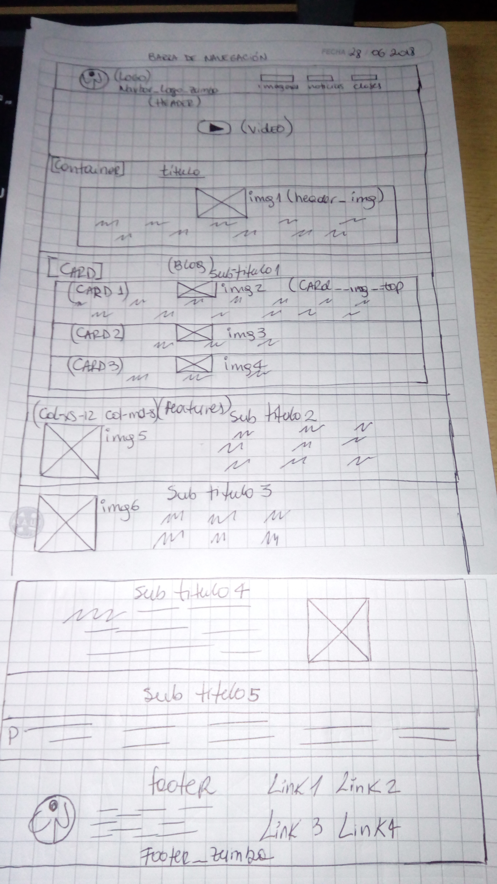
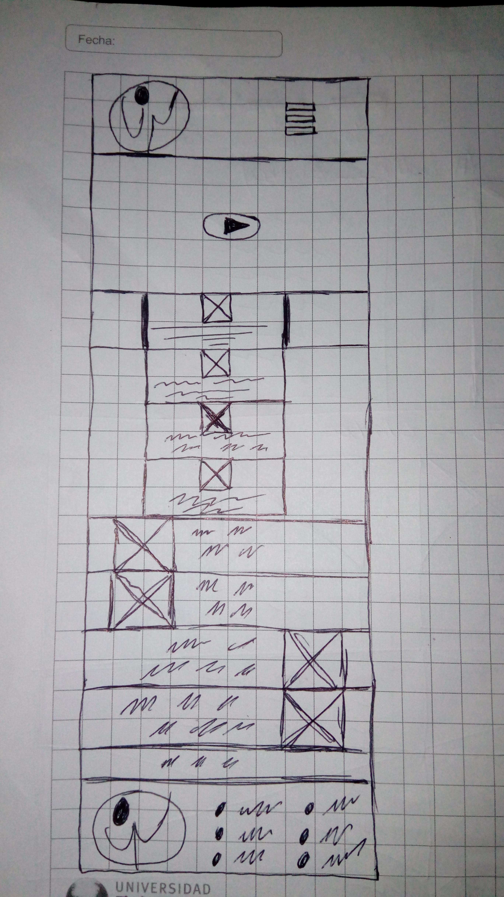

#Estimada Profesora Trini:

agrego los elementos faltantes, los que corrigio en la pauta, como el uso del viewport en html y css.
también el uso de grillas para que sea responsivo.
además de los cambios de colores para que se lea mejor el contenido.

Si tengo dudas con el uso de las media Queries, las integre pero no supe si de forma correcta.
Saludos y gracias.

# Primer entregable

## El tema seleccionado

El tema elegido es "Página web vida sana de la comuna"
	Dirigido en las clases de Zumba Fitness distribuidas alrededor de todos los sectores de la comuna, horarios y direcciones de las clases. por otra parte los recreos saludables realizados en las escuelas de la comuna.

¿Porqué? siempre es escasa la difusión de la información,por lo cual esta herramienta llega a suplir esa necesidad.

## Los objetivos para la interfaz (ui) y para la experiencia de usuario(ux).

(ux)

Que es lo que podrán hacer en esta página web:

- En la página principal podrán acceder al link clases, noticias, galeria.

- tendrá publicaciones de noticias y actividades masivas a realizar en la comuna, como zumbatón, corridas solidarias, preventivos de salud. 

- Publicacion de imágenes de las clases de zumba y recreos saludables; además de videos de las clases de zumba y recreos saludables.

- Tambien tips saludables en relación a:

1. Alimemtación.
2. Ejercicios para practicar en casa.
3. Calidad del aire.
4. información (siempre actulizada) respecto de la modificación o suspensión de las actividades.

-Qué es el producto.

Este es un producto de caracter informativo que otorga a la comunidad Quilicurana, horarios y direccion de las clases de Zumba Fitness en el proyecto vida sana.
además de videos e imágenes y testimonios de personas que participan activamente del programa.

por otra parte da a conocer el programa de "Recreos saludables" dirigido a los alumnos más pequeños de distintos colegios de la comuna como el colegio Santiago de Quilicura, Escuela Ana frank, Santa Teresa de Quilicura, etc.

-Quién está usando el producto.

las Quilicuranas de deseen realizar actividad física a traves de unas entretenidas clases de Zumba.

En el caso de los recreos saludables son los hijos de mujeres de quilicura quienes reciben este beneficio de llevar la actividad física a los recreos escolares.

-Por qué lo usan.

para mantenerce informadas de las clases con el objetivo de mejorar su condición física y llevar una vida sana.

(ui)

La interfaz de usuario será responsiva y de visualización rápida para ser vista en notebook y telefono móvil.

Arquitectura de la información:

a. Barra de navegación (con 3 botones que dirigen a otras páginas)

b. Header;con videos 

c. Blog; con imagenes interactivas e información actualizada.

d. Features; con tips faciles de comprender y ejecutar.

e. Footer; con información de contacto.

Patrones de interacción: botones, videos, imágenes, iconos, formulario de contacto, mapas, calculo de IMC.

Elementos Visuales: utilizaré fondo blanco y variedad de colores y tipografía moderna.

## Los requerimientos del sitio.

### requerimientos generales

1. 	- Una página web tipo landing page la cual contiene:

   	- Barra de navegación y Footer.
   	- debe tener 5 secciones:

   	la primera es navbar: donde van botones que te llevan a otra pestaña; clases, noticias, galería. al lado izquierdo un logo de zumba o vida sana.

   	la segunda es header: donde va un video de una clase de zumba y al costado una reseña explicativa de su historia y benficios para la salud.

   	la tercera es blog: donde van 3 columnas con imagenes e información abajo. (imagenes reales de alumnas y experiencias)

   	la cuarta en features: donde va al lado derecho una imágen y al lado izquierdo una leyenda. (imagenes de ejercicios y respectiva explicacion)

   	la quinta es footer: va el logo de zumba y vida sana ademas de telefonos y correos de contacto.

2. Las secciones de la siguiente manera:

- Navbar

- Header.

- Blog.

- Features.

- Footer.

3. Definición de las clases en la página web:

- En el navbar

navbar__zumba

navbar__logo__zumba

Botones: 
clases__zumba

Noticias__zumba
         
Galeria__zumba

- En el header

Header__zumba

header__video__zumba

Boton__video

- En el blog

Blog__zumba

img__blog

img2__blog

img3__blog

- En features

Features__zumba

img__features

img2__features

- En footer

Footer__zumba

logo__footer

### requerimientos especificos

1. La página web debe ser responsiva.

- Debe dar información y difusión de las actividades.

- La información debe ser clara y dinámica incluir fotos, videos y experiencia de las mujeres que asisten a clases regularmente y participan de las actividades.

### Requerimientos visuales

- Layout: Debe usar Bootstrap.

- Componentes: usaré grillas.

- Contenidos: De carácter informativo. 

Visual:

fuentes usadas de "google fonts".

 para los títulos: font-family: 'Shadows Into Light Two', cursive;

 para parrafos y otros elementos: font-family: 'Poor Story', cursive;

 Colores: 
 - Base para titulos h1= #fffcfc

 - Base para titulos h2= #302e2e

 - Base de todos los titulos h3,h4,h5,h6= #fffcfc
 
 - Para  barra de navegacion y footer= #fffcfc

 - Letras de barra de navegación y footer= #302e2e y #0040a8

 - Base para los parrafos= #fffcfc y #302e2e 

 Imágenes: 

 - contenidas dentro de carpeta imágenes,(serán realaes ).

## La definición de layout (tipo de página).

-Será tipo blog.

#### imágen maqueta
 

#### imágen maqueta celular

